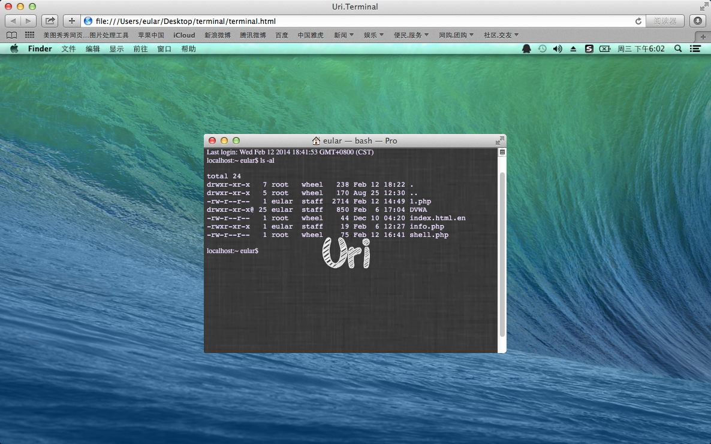

Web Terminal
=================
一个网页版的终端
----------

##Usage:
###需上传webshell
<pre>
&lt;head&gt;
	&lt;title&gt;Uri.Terminal&lt;/title&gt;
	&lt;style type="text/css"&gt;
	body{
		background-color: #1c1c1c;
		background: url('bg.png');
		background-size: 100% 100%;
	}
	&lt;/style&gt;
	&lt;link rel="stylesheet" type="text/css" href="terminal.css"&gt;
	&lt;script type="text/javascript" src="terminal.js"&gt;&lt;/script&gt;
&lt;/head&gt;

&lt;terminal&gt;
	&lt;div class="terminalWindow"&gt;
		&lt;div class="terminal font"&gt;
			&lt;div&gt;Last login: &lt;span&gt;Wed Feb 12 13:38:31&lt;span&gt; on ttys000&lt;/div&gt;
			&lt;div&gt;localhost:~ eular$ &lt;span&gt;&lt;input name="shell"&gt;&lt;/span&gt;&lt;/div&gt;
		&lt;/div&gt;
	&lt;/div&gt;
&lt;/terminal&gt;
</pre>